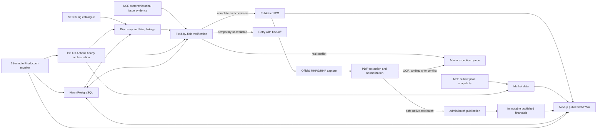

# IPOBharosa — canonical project handoff

> Last reconciled: 18 August 2026 (Asia/Kolkata)  
> Repository: <https://github.com/aishuo07/ipobharosa>  
> Production: <https://ipobharosa.vercel.app>  
> Production branch: `main`  
> Baseline commit when this handoff was written: `567b6ee`

This is the canonical starting document for a new engineer or coding agent. It
combines the product intent, architecture, operational state, source policy,
completed work, open risks and safe next steps. Verify live state before making
mutations: timestamps and counts in this document are evidence snapshots, not a
substitute for a fresh health check.

## 1. Thirty-second orientation

IPOBharosa is a trust-first IPO information product for Indian retail
investors. It covers Mainboard and SME IPOs in a date-first board, explains
what is happening today and next, and exposes the source, freshness and
verification state behind every important number.

The product is deliberately different from a typical IPO content site:

- official NSE and SEBI evidence is the primary layer;
- unofficial GMP is never presented as an official or guaranteed number;
- missing data gets an explicit reason instead of a fabricated value;
- financial figures are published only with filing/page evidence and an audit
  trail;
- Mainboard and SME coverage are first-class;
- calendar sync, watchlists, reminders and a PWA make the data actionable;
- the interface is compact, calm, mobile-first and ad-free.

The product does **not** have exclusive market data, years of SEO authority, a
native mobile app, or a live IPO order-placement integration. Its moat is
transparent evidence, honest freshness and a better decision workflow.

## 2. Current verified Production snapshot

The latest evidence collected before this handoff was:

| Signal | Verified state |
|---|---|
| Public health | `ok`; database reachable; ingestion fresh; source pipeline healthy |
| Health timestamp | 17 Aug 2026 20:31:49 UTC |
| Latest scheduled ingestion | Successful GitHub Actions run `32064452000` |
| Ingestion run ID | `2b27ce45-8a86-4ccb-aa33-ac5475639e2d` |
| Schedule | Every hour (`0 * * * *`) |
| Official catalogue | 100 filings seen/stored; 29 linked; 71 deferred/unlinked |
| Published revalidation | 4 targeted, 4 checked, 4 matched, 0 drift/retry/invalid |
| NSE subscription | 8 snapshots written; 0 failed; 1 not yet available; 7 not covered |
| New allowed GMP snapshots | 0; 18 lifecycle-eligible IPOs had no permitted quote |
| Reminders in that run | 0 sent, 0 failed, 0 skipped |
| Production monitor | Last observed runs green; executes every 15 minutes |

Interpret those numbers correctly:

- `18` is **not** the total number of IPOs on the board. It is the subset that
  was lifecycle-eligible for market-signal ingestion in that run.
- `71 deferred/unlinked` filings are **not automatically 71 missing active
  IPOs**. Many are early DRHP filings without final terms. They must be linked
  or promoted only when official final issue evidence exists.
- Zero new GMP snapshots is an intentional launch-safe state while no
  unofficial provider has documented commercial-use approval. It is not a
  database or cron failure.
- The historical public board had 65 IPO records at the recovery snapshot.
  Always read Production for the latest published/draft counts.

Current public health check:

```bash
curl --fail --silent --show-error https://ipobharosa.vercel.app/api/health
```

Current workflow check:

```bash
gh run list --repo aishuo07/ipobharosa --limit 20
```

## 3. Product surfaces

### Public

- `/` — date-first “today and next” market ledger plus IPO discovery.
- `/ipo/[slug]` — IPO detail, dates, terms, demand, GMP provenance, official
  evidence links and published financials.
- calendar views and `/api/calendar` — chronological milestones and `.ics`
  calendar subscription/download.
- search, compare and Mainboard/SME filters.
- Google sign-in, watchlist and reminder surfaces when configured.
- installable PWA. This is currently the mobile strategy; there is no native
  iOS/Android app.

### Admin

- `/admin` — operational/source status and exception workflows.
- `/admin/financials` — financial classification, batch publication and
  genuine exception review. Authentication and admin allowlisting are required.
- `/admin/financials/manual` — explicit correction/manual evidence path.

### Important APIs and jobs

- `/api/health` — minimal non-sensitive service and freshness health.
- `/api/cron/ingest` — protected, resumable hourly ingestion.
- `/api/cron/filing-evidence` — protected official filing capture.
- `/api/admin/extract-all-financials` and
  `/api/admin/submit-extracted-financials` — protected extraction flow.
- Auth.js routes, watchlist mutations and calendar feed routes.

## 4. Architecture



### Technology

- Next.js 16.3 App Router, TypeScript, React 19.2.
- PostgreSQL 17 on Neon, Prisma 7.9 with the PostgreSQL driver adapter.
- Auth.js/NextAuth v5 beta with Prisma adapter and Google OAuth.
- Vitest for TypeScript behavior; Python tests for the PDF extractor.
- GitHub Actions for ingestion, official evidence capture, financial
  extraction, CI and independent Production monitoring.
- Vercel for Preview and Production deployment.

## 5. Data and verification contracts

### 5.1 IPO discovery and publication

Intended state machine:

```text
Discover filing
→ collect official evidence independently
→ normalize and compare fields
→ official core fields complete and consistent: publish/revalidate
→ official source temporarily unavailable: retry with backoff
→ actual value conflict: exception queue
→ unsupported/early filing: retain as pipeline evidence, do not invent terms
```

Core fields include company, board, price band, lot size, opening/closing and
listing milestones, registrar and official document references. Sector is
optional enrichment and must not block an otherwise valid issue.

`IpoFilingCatalogue` is intentionally separate from `Ipo`. A DRHP announces a
possible issue but often has no final price, dates or lot size. Treating every
DRHP as a live IPO would create false coverage.

Evidence captures are append-only. Revalidation must not silently overwrite a
published value when official evidence changes: create a drift incident and an
auditable correction path.

### 5.2 Source policy

| Source | Role | New collection policy |
|---|---|---|
| NSE | Official primary for current/historical issue terms and subscription | Enabled |
| SEBI | Official primary filing catalogue/discovery radar | Enabled |
| BSE | Potential official source | Automated access returned `403`; do not bypass |
| Registrars | Authoritative for allotment/status | Use for that boundary, not full issue terms |
| Bank sites | Secondary confirmation | Never the sole source of truth |
| IPOWatch | Historical unofficial GMP provenance | Hard-disabled; terms conflict for commercial use |
| Sahi | Historical unofficial GMP provenance | Hard-disabled; written permission required |
| IPOJi | Optional unofficial GMP provider | Disabled unless explicitly approved in `GMP_SOURCE_ALLOWLIST` |
| InvestorGain | Optional unofficial GMP provider | Disabled unless explicitly approved in `GMP_SOURCE_ALLOWLIST` |

Historical GMP observations remain in the database for provenance. A disabled
source must not be rendered as fresh/current merely because an old row exists.
Never scrape around a block or bypass terms to make the UI look populated.

### 5.3 GMP

GMP is unofficial and unregulated. When approved providers are available, the
system stores source observations, computes a median/spread and derives a
confidence tier based on source agreement and freshness. A source failure
degrades confidence; it must not break the entire run.

Until commercial-use approval exists, the honest public result is an explicit
“No tracked GMP quote yet”/source-policy reason. Do not restore old adapters
just to remove empty states.

### 5.4 Subscription/demand

Use official NSE snapshots where the issue is covered. Distinguish:

- snapshot captured;
- not yet available;
- issue not covered by that endpoint;
- temporary source failure.

Do not collapse all of these into `0` or “unavailable”.

### 5.5 Financials

Pipeline:

```text
Official filing URL
→ immutable document/checksum capture
→ native PDF text extraction (OCR fallback only when needed)
→ fiscal year, units, scope and audit/restatement normalization
→ value/page/table/confidence evidence
→ safe-batch classification or exception review
→ authenticated atomic batch publication
→ immutable FinancialPublished record + correction log
```

A financial candidate is safe only when all of the following are true:

- official DRHP/RHP/Prospectus evidence;
- latest evidence for that filing;
- native text rather than uncertain OCR;
- confidence at least `0.90`;
- audited/restated status and standalone/consolidated scope are known;
- page/table citation and validation rules are present;
- no prior published mismatch;
- duplicate extractions agree.

PR #69 removed the need for 78 individual row decisions. The admin can preview
classification with **no writes**, apply safe classification, and publish one
atomic batch per filing. Classification does not itself publish. OCR,
ambiguous scope, conflicts and mismatches remain genuine human exceptions.

Recovery evidence showed 103 `FinancialRevision` rows but only 2
`FinancialPublished` rows at the snapshot. Do not claim broad “verified
financials” coverage until current Production classification and publication
counts have been reviewed in the authenticated admin UI.

## 6. Data model map

The Prisma schema is the authoritative contract. Major groups:

- IPO: `Company`, `Ipo`, `IpoFilingCatalogue`, `DiscoveryAttempt`.
- Official evidence: `OfficialEvidenceCapture`, `OfficialSourceAttempt`,
  `OfficialFieldComparison`, `OfficialEvidenceIncident`, `Document`.
- Market signals: `GmpSource`, `GmpObservation`, `GmpSnapshot`,
  `SubscriptionSnapshot`, `SourceHealth`, `SourceOperationHealth`.
- Financials: `FinancialDocument`, `FinancialExtraction`,
  `FinancialRevision`, `FinancialPublished`, `FinancialSnapshot`,
  `CorrectionLog`.
- User features: Auth.js `User`, `Account`, `Session`, `VerificationToken`,
  plus `WatchlistItem`, `AlertSubscription`, `ReminderDelivery`.
- Operations: `IngestionLock`, `IngestionRun`, `DigestDelivery`.

Publication and lifecycle are separate concepts. A record can be publicly
visible with an honest pending verification label without pretending every
field is verified. Rejected/quarantined records must not leak onto the public
board.

### Committed migrations

Seven migrations matched Production during the restore rehearsal:

```text
20260811134018_init
20260812152000_release_foundation
20260812194500_discovery_retry_backoff
20260812233000_official_ipo_evidence
20260813120000_ipo_filing_catalogue
20260814090000_ingestion_reliability
20260814194000_multi_source_official_evidence
```

Never run `prisma migrate deploy` blindly against Production. Inspect migration
status and diff first; do not recreate/baseline existing objects.

## 7. Automation and operations

| Workflow | Schedule | Purpose |
|---|---|---|
| `ingest.yml` | Hourly | Resumable catalogue, verification, GMP, subscription and reminder cycle |
| `production-health.yml` | Every 15 minutes | Public routes, database/freshness and source-pipeline monitoring |
| `filing-evidence.yml` | Daily 00:45 UTC | Bounded official filing capture |
| `financial-extraction.yml` | Daily 01:30 UTC | Python extraction worker and protected submission |
| `ci.yml` | Pull requests/push | Lint, tests, Prisma validation/migration exercise and build |

The ingestion workflow has a 40-minute job timeout, a Production concurrency
group, a persisted checkpoint and an ingestion lock. Before manually
dispatching it, verify that no other run owns the lock. Resume an interrupted
run; do not create overlapping work to make results arrive faster.

The health endpoint returns `503` when the database is unreachable, no
successful ingestion exists, or freshness exceeds 150 minutes. The independent
monitor opens one deduplicated GitHub issue on degradation and closes it after
recovery.

Operations runbook: [`docs/OPERATIONS.md`](OPERATIONS.md).

### Recovery proof

PR #71 documents a real isolated Neon restore rehearsal:

- temporary read-only branch: `br-royal-math-avtpa6e6` (deleted after test);
- restore point: 17 Aug 2026 10:24:16 UTC;
- branch-ready RTO: 14 seconds;
- operational RTO: 2 minutes 45 seconds;
- effective RPO: 29 minutes 14 seconds, within the six-hour retention window;
- `transaction_read_only=on`, written data bytes `0`;
- restored counts: 65 IPOs, 107 filing rows, 13,920 GMP observations,
  103 financial revisions, 2 published financial values, 1 user, 0 watchlists;
- Production had 108 filing rows at comparison time—one legitimate row newer
  than the restore point; other checked counts matched.

Evidence: [`docs/reports/2026-08-17-neon-restore-rehearsal.md`](reports/2026-08-17-neon-restore-rehearsal.md).

## 8. Frontend and design system

The visual direction is professional Indian fintech rather than a news portal:
clean like Zerodha, with a small distinctive warm/tangy accent.

- warm off-white paper, white surfaces, deep green trust actions;
- saffron/orange accent for highlights and warnings;
- Newsreader for restrained editorial display type, DM Sans for UI, monospace
  for numeric/provenance labels;
- dense date-ledger rows instead of oversized cards;
- colour semantics: green/open, burnt orange/closing, orange/allotment,
  blue/listing, red/critical;
- compact badges, strong tabular number alignment, visible source links;
- horizontal scrolling/sticky first column for dense mobile tables;
- motion is subtle (`120–180ms`) and functional, with visible focus rings;
- both light and dark tokens exist, but visual regression should focus on the
  public default theme and all supported widths.

The token source of truth is `src/app/globals.css`; shared primitives are
`.ui-button`, `.ui-badge`, `.ui-surface`, form, tab and state classes. Reuse
these before inventing new one-off inline styles.

Responsive acceptance widths used historically: 360, 390, 768, 1024 and
1440 px. Verify no horizontal page overflow; only intentional table/row
containers may scroll.

## 9. Authentication, email and sensitive data

Configuration names are documented in `.env.example`. Never put values in
issues, PR descriptions, logs or this handoff.

Required categories:

- canonical origin: `NEXT_PUBLIC_SITE_URL`, `SITE_URL`;
- database/auth: `DATABASE_URL`, `AUTH_SECRET`;
- Google: `AUTH_GOOGLE_ID`, `AUTH_GOOGLE_SECRET`;
- optional email: `EMAIL_USER_FEATURES_ENABLED`, `RESEND_API_KEY`,
  `AUTH_EMAIL_FROM`;
- protected automation: `CRON_SECRET`, `ADMIN_BEARER_TOKEN`;
- approved unofficial providers: `GMP_SOURCE_ALLOWLIST`.

Known repository configuration names include GitHub secrets
`ADMIN_BEARER_TOKEN`, `CRON_SECRET`, `DEV_DATABASE_URL`, and variable `SITE_URL`.
These are names only; do not attempt to print their values.

Google sign-in has worked end-to-end. Email sign-in/reminders remain hidden
unless sender-domain verification and all required settings are complete. At
the restore snapshot there was one user and zero watchlist rows, so a real-user
reminder loop has not been proven.

## 10. Release discipline

`main` is Production.

1. Start from latest `origin/main` on a short `codex/<concern>` branch.
2. Make one small coherent PR.
3. Run `npm run lint`, `npm test`, `npm run build` and relevant Python tests.
4. Let CI exercise clean migrations and build.
5. Verify the Vercel Preview with the isolated Development database.
6. Test frontend states, backend success/failure, auth boundaries, responsive
   widths and any migration.
7. Merge only after CI and Preview are green.
8. Perform read-only Production smoke checks on the merged commit.

Preview must never receive Production database credentials, personal data or
live email delivery credentials.

Useful commands:

```bash
npm ci
npm run check
npm run db:validate
npm run smoke:preview -- https://preview.example
git status --short
gh pr checks <number> --repo aishuo07/ipobharosa
```

## 11. What has been delivered

The release foundation and major product slices are already merged. Important
recent PRs:

- #45 financial summary layouts.
- #46 date board, calendar and trust-contract corrections.
- #47 hydration fix.
- #48 date-first homepage.
- #49 hourly refresh.
- #50 homepage polish.
- #51 compact agenda and SME GMP states.
- #52 horizontally scrollable dense rows.
- #53 public launch foundation.
- #54 installable PWA.
- #55 monitoring and operations runbook.
- #56 monitoring runtime update.
- #57 source-health reporting.
- #58 discovery resilience.
- #59 common financial layouts.
- #60 source degradation exposed through health.
- #61 Production ingestion recovery.
- #63 expanded financial layouts.
- #64 official filing mirror fallback.
- #65 bounded document-download timeout.
- #66/#67 official mirror/download recovery for a hard filing case.
- #69 safe financial batch classification/publication.
- #70 launch-safe official source policy.
- #71 isolated Neon recovery rehearsal evidence.

Do not repeat these from scratch. Read the merged code and tests first.

## 12. What is still open

### P0 before unrestricted public launch

1. **Financial publication closure**
   - Sign into `/admin/financials` with an allowlisted admin.
   - Preview current classification without writes and record exact safe-batch,
     review-required and conflict counts.
   - Apply/publish safe batches only after reviewing representative evidence.
   - Do not advertise broad verified-financial coverage until published counts
     support it.

2. **Custom domain and email/reminder proof**
   - Buy/connect the final domain.
   - Verify the Resend sender domain and OAuth callbacks.
   - Enable user email features only after configuration is complete.
   - Prove one real loop: sign in → watchlist → reminder sent → link resolves.

3. **GMP product decision**
   - Either launch with honest no-GMP states, or obtain documented
     commercial-use approval from an allowlisted provider.
   - Never re-enable IPOWatch/Sahi or an unapproved provider as a shortcut.

4. **Invite beta**
   - 10–20 real users for 5–7 days.
   - Observe freshness, broken official links, auth, mobile layout, calendar
     import, watchlist and reminders.
   - Fix high-impact problems before unrestricted acquisition.

5. **Coverage reconciliation**
   - Reconcile public Mainboard/SME records against current NSE/SEBI issues.
   - Triage the 71 catalogue filings into early/not-final, linkable, retrying,
     conflicting or unsupported—do not call all of them missing IPOs.
   - Keep “pending automated verification” records visible when dates are useful
     and labels are honest; never expose rejected/quarantined records.

### P1 reliability/product work

- Increase financial extraction coverage for native and OCR filing layouts
  while keeping uncertainty in the exception queue.
- Improve admin issue grouping, source-health explanations and correction UX.
- Confirm calendar subscription behavior on Google Calendar, Apple Calendar
  and common Android clients with a real external user.
- Add product analytics/privacy consent appropriate for beta; currently real
  user behavior is largely unknown.
- Audit and close/split stale GitHub issues rather than treating old titles as
  the current implementation state.
- Refresh public/legal pages, attribution, privacy and terms before collecting
  a wider audience.
- Decide whether a native app is justified only after PWA beta retention data.

### Open GitHub issues to audit

At handoff time these remained open:

- #6 official RHP/DRHP ingestion with immutable evidence.
- #7 native PDF financial candidates with page evidence.
- #8 OCR fallback.
- #9 financial review/corrections/versioning/public reads.
- #10 custom domain, email, auth, reminders and observability readiness.
- #11 provider-neutral IPO application demo with dummy data.
- #12 Codifi/ODIN sandbox only after written approval.

Parts of #6, #7 and #9 are already substantially implemented. First action is
to compare acceptance criteria against merged code, then close or split the
remaining gap. Do not rebuild the same feature under a new issue.

## 13. Future IPO application workflow

The researched product concept is:

```text
Select IPO
→ select consenting applicants/family members
→ review one separate application per applicant
→ applicant-specific consent/OTP
→ submit through an approved intermediary
→ each applicant approves their own UPI mandate
→ track mandate/order status
```

Each applicant must use their own PAN, demat, mobile/email and linked UPI ID.
No pooled funds or third-party UPI substitution. Contact was drafted/sent to
Codifi and SynapseWave/ODIN asking about external demat holders, UCC
requirements, multi-broker IPO modules, OTP/consent, webhooks, sandbox,
security, pricing and onboarding.

No suitable public order-placement API has been confirmed. Until written
provider/compliance approval and sandbox credentials exist:

- use dummy data only;
- do not store real PAN, demat or UPI details;
- do not submit real bids;
- do not reverse-engineer a broker's private endpoints;
- keep this feature out of the critical public-launch path.

## 14. Safety rails

Never:

- invent, infer or silently overwrite price, date, subscription, GMP or
  financial values;
- bypass BSE/provider access controls or source terms;
- expose secrets, Production credentials or personal data;
- point a Preview at the Production database;
- run destructive schema/data operations on Production;
- dispatch overlapping ingestion while a lock/run is active;
- auto-publish OCR ambiguity or official conflicts;
- claim GMP is official, or claim financial coverage beyond published evidence;
- collect real IPO-application identity/payment data before the regulated
  integration path is approved.

Prefer append-only evidence, explicit states, idempotent retries, bounded work,
atomic publication, auditable corrections and read-only Production checks.

## 15. Documentation truth map

- **Start here:** this file, `docs/AGENT_HANDOFF.md`.
- **Operations:** `docs/OPERATIONS.md`.
- **Recovery evidence:** `docs/reports/2026-08-17-neon-restore-rehearsal.md`.
- **Detailed implementation history:** `plan.md` and `implementation-log.md`.
- **Release foundation history:** `docs/EXECPLAN.md`.
- **Old status snapshot:** `docs/STATUS.md` is stale (12 August context) and
  must not be treated as current truth.
- **Schema truth:** `prisma/schema.prisma` and committed migrations.
- **Source-policy truth:** `src/lib/sourcePolicy.ts`.
- **Visual token truth:** `src/app/globals.css`.
- **Workflow truth:** `.github/workflows/`.

If a prose document conflicts with executable code and a fresh Production
read, stop and reconcile the difference explicitly.

## 16. Recommended first session for the next agent

1. Read this document, `README.md`, `docs/OPERATIONS.md`, `AGENTS.md` and the
   files relevant to the requested slice.
2. Run `git fetch origin`, confirm a clean tree and inspect latest `main`.
3. Check public health, latest workflows, open PRs and open monitoring issues.
4. Verify that source-policy, cron schedule and migration list still match this
   handoff.
5. Pick **one** P0/P1 concern, write explicit acceptance criteria, and deliver
   it through a small PR and Preview.
6. Update this handoff when current architecture, launch gates or verified
   Production evidence materially change.

Copy-ready agent prompt:

```text
Work in https://github.com/aishuo07/ipobharosa.
Read docs/AGENT_HANDOFF.md completely before acting. Treat it as the canonical
project context but verify live health/workflow state because its counts are a
snapshot. Preserve the source policy, evidence/audit model, Production safety
rails and small-PR Preview workflow. Do not expose secrets, use Production data
in Preview, invent market values, or enable unapproved GMP/order providers.
Start by reporting the fresh repo/Production state and the smallest safe next
slice; then implement, test, create a PR, verify CI + Vercel Preview, and merge
only when accepted.
```

